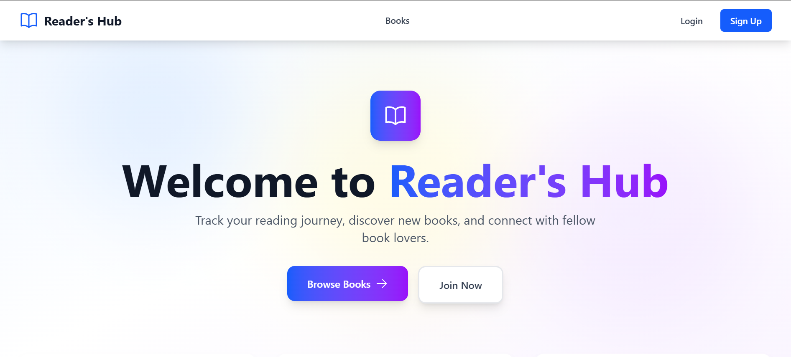
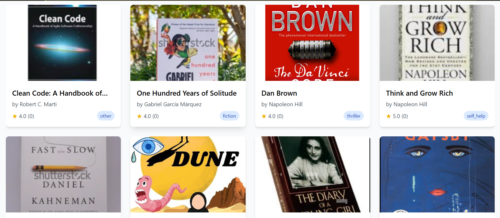
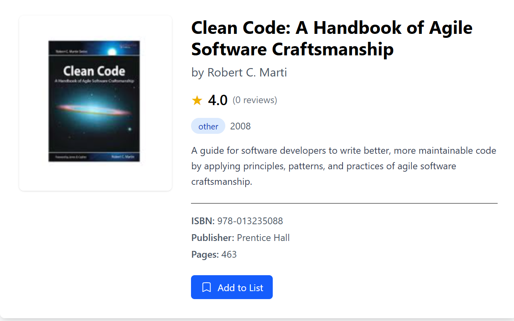
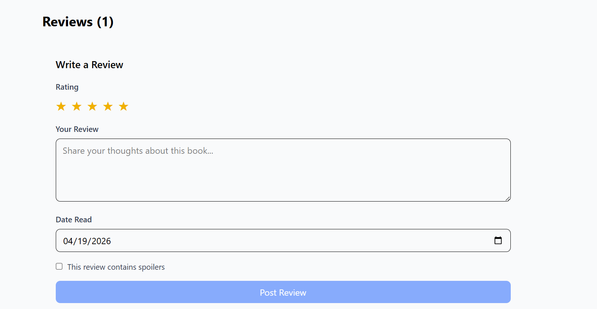
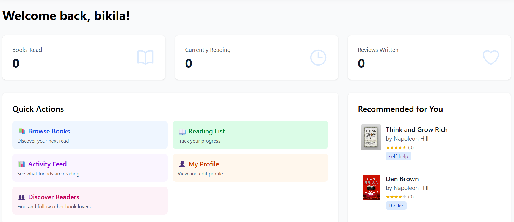
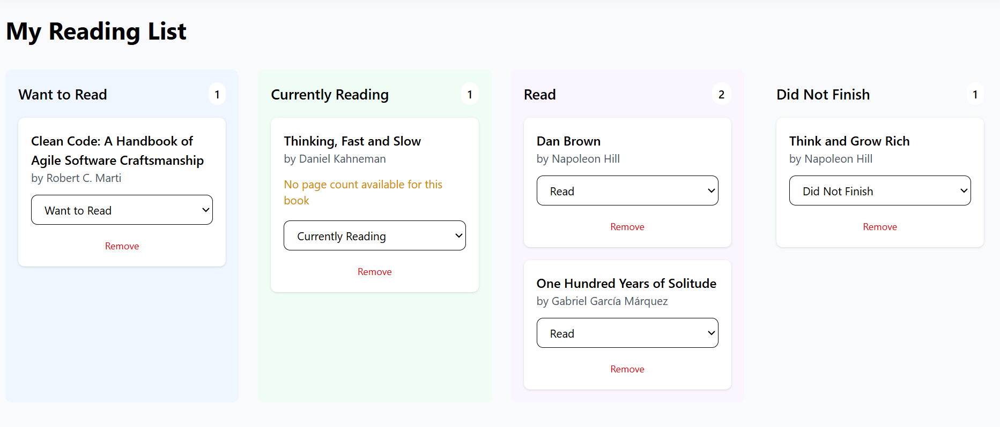
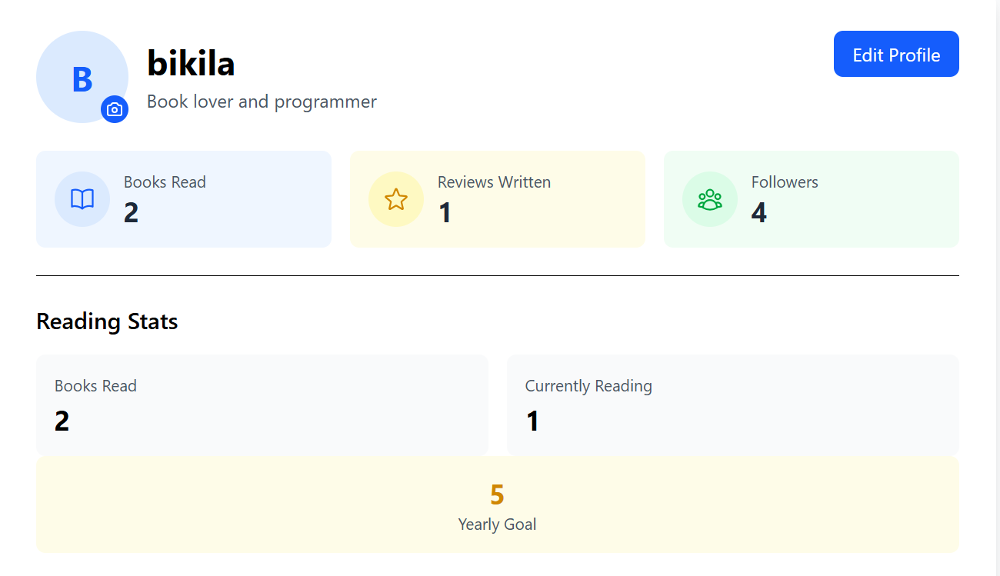
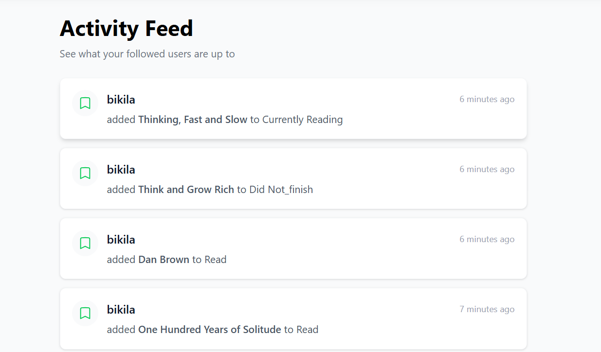
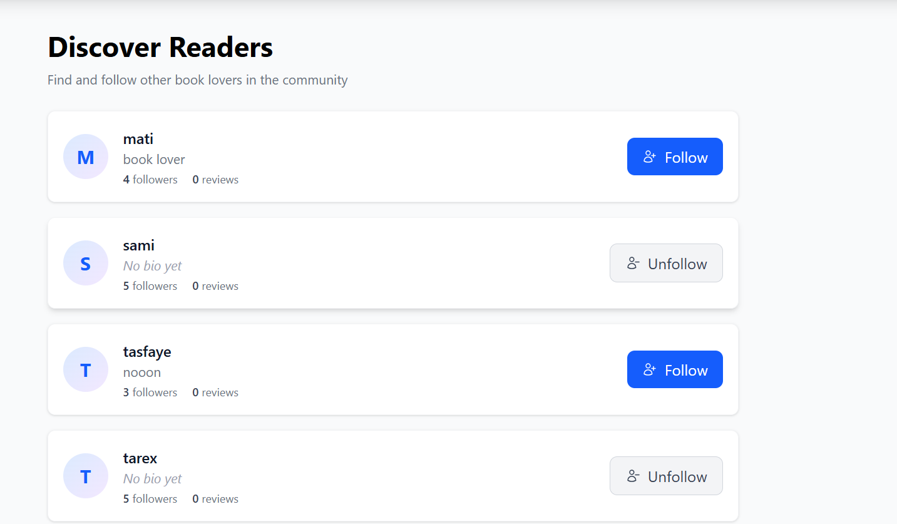

# 📚 Reader's Hub - Frontend

A modern, responsive React frontend for the Reader's Hub book review platform. Track your reading journey, write reviews, connect with fellow book lovers, and get personalized recommendations.

## 🌐 Live Demo

| Service | URL |
|---------|-----|
| **Frontend Application** | [https://readers-hub-frontend-agwp-hs6wwbckc-tarikumato-7369s-projects.vercel.app](https://readers-hub-frontend-agwp-hs6wwbckc-tarikumato-7369s-projects.vercel.app) |
| **Backend API** | [https://readers-hub-api.onrender.com](https://readers-hub-api.onrender.com) |
| **API Documentation** | [https://readers-hub-api.onrender.com/swagger/](https://readers-hub-api.onrender.com/swagger/) |

## 📸 Screenshots

### Main Pages
| Homepage | Books Page |
|----------|------------|
|  |  |

| Book Detail | Write Review |
|-------------|--------------|
|  |  |

### User Features
| Dashboard | Reading List |
|-----------|--------------|
|  |  |

| Profile | Activity Feed |
|---------|---------------|
|  |  |

### Social Features
| Discover Users | Reviews & Comments |
|----------------|-------------------|
|  |  |

## ✨ Features

### 🔐 Authentication
- User registration with email, bio, and reading goals
- JWT token-based authentication
- Protected routes for authenticated users
- Profile editing with avatar upload

### 📚 Books
- Browse books with infinite scroll pagination
- Real-time search by title/author
- Filter by genre
- Sort by rating, date, popularity
- Detailed book view with description and metadata

### ⭐ Reviews & Ratings
- Write, edit, and delete reviews
- 1-5 star rating system
- Spoiler warnings for reviews
- Like/unlike reviews
- View all reviews for a book

### 📖 Reading List
- Track books with status: Want to Read, Currently Reading, Read
- Update reading progress (page number)
- Progress bar visualization
- Personal notes for each book

### 👥 Social Features
- Follow/unfollow other readers
- View followers and following lists
- Activity feed showing actions from followed users
- Discover users page to find new readers

### 🎯 Dashboard
- Reading statistics (books read, currently reading, reviews written)
- Reading goal progress tracker
- Quick action buttons
- Personalized book recommendations

### 💬 Comments
- Comment on reviews
- Edit and delete your own comments
- Nested replies support

### 🎨 UI/UX
- Fully responsive design (mobile, tablet, desktop)
- Smooth animations with Framer Motion
- Toast notifications for user actions
- Loading skeletons for better UX
- Error boundaries for graceful degradation

## 🛠 Tech Stack

| Technology | Purpose |
|------------|---------|
| **React 19** | UI framework |
| **Vite** | Build tool and dev server |
| **Tailwind CSS** | Styling and responsive design |
| **React Router v7** | Client-side routing |
| **TanStack Query** | Data fetching, caching, and state management |
| **Axios** | HTTP client for API calls |
| **Framer Motion** | Animations and transitions |
| **Heroicons** | SVG icon library |
| **date-fns** | Date formatting and manipulation |
| **React Hot Toast** | Toast notifications |

